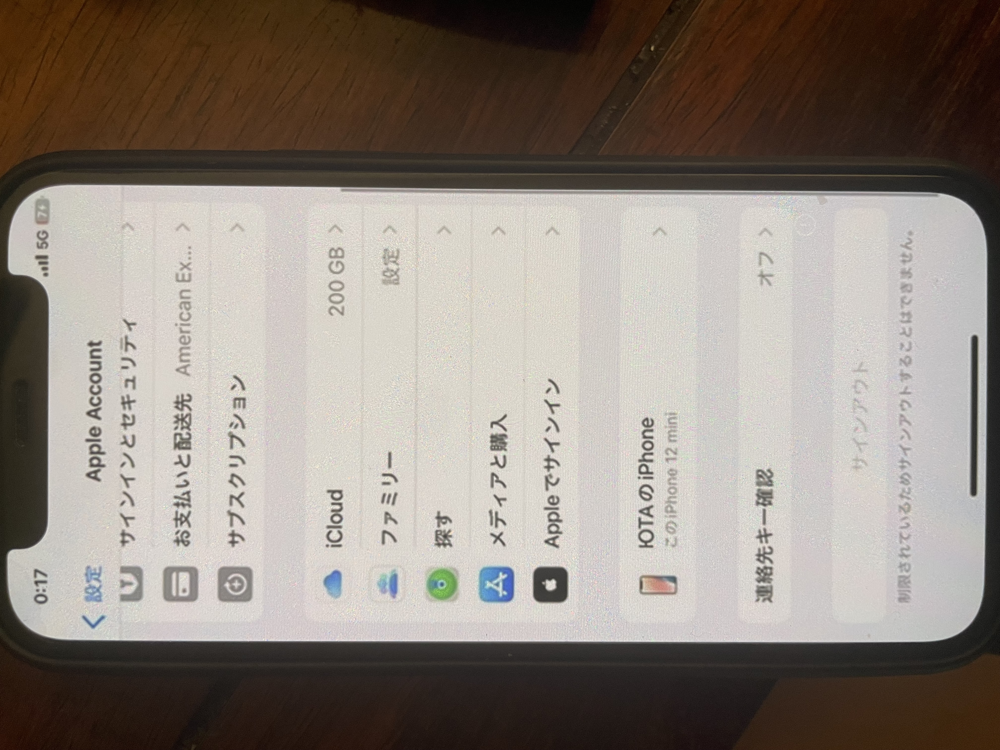

# My personal iPhone shows management-like restrictions

This is a personal iPhone, not a company-managed device.

I did not intentionally enroll it as a corporate device, yet the Apple Account screen shows Sign Out disabled with a restriction message.

I am publishing this because similar management-related traces and Screen Time-related symptoms appeared across multiple devices and dates.

Main question:

Why would an unmanaged personal iPhone show management-related traces and restriction symptoms like this?

## What makes this unusual

- personal iPhone, not a company phone
- visible restriction symptom on the Apple Account screen
- related management-adjacent traces appeared repeatedly across devices and dates
